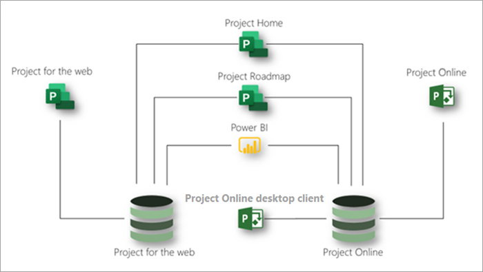

# Microsoft Project 服務說明

## 概觀

Microsoft Project 提供下列應用程式，協助滿足您組織的專案和工作管理的需求：

- Project 網頁版
- Project Online 
- Project Online 桌面用戶端

本文將協助您瞭解每個專案訂閱中提供的應用程式，以及每個應用程式提供的功能。

### Project 網頁版

Web 的專案是 Microsoft 最近針對雲端架構工作和專案管理提供的服務。 Web 的專案提供簡單且強大的工作管理功能，以符合大多數需求和角色。 專案經理和小組成員可以使用 Web 專案來規劃及管理任何規模的工作。

Web 的專案是以 Microsoft Power 平臺為基礎。 [電源平臺] 包括 PowerApps、電源自動化、Power BI 及一般資料服務 (CD) 。 Web 資料的專案儲存在 CD 中。 

可透過三個訂閱取得 web 的專案：專案方案1、專案方案3及專案方案5。 [Web 功能](#project-for-the-web-features)區段之專案中所列的功能只會與 web 資料存放區之專案中的資料進行互動。

### Project Online
 
Project Online 是一種靈活的線上方案，可用於專案產品群組管理 (PPM) 和日常工作。 Project Online 可提供強大的專案管理功能，以在 &mdash; 幾乎任何裝置上的幾乎任何地方規劃、排序及管理專案與專案產品群組的投資。 系統管理員、組合管理員和檢視者、專案和資源管理員、小組負責人和成員都可以使用 Project Online。

Project Online 是在 SharePoint 平臺上建立，它會將資料儲存在 SharePoint 資料儲存區中。

Project Online 可透過兩種訂閱進行：專案計劃3和專案方案5。 [ [Project online 功能](#project-online-features) ] 區段中所列的功能只會與 project online 中的資料 SharePoint 資料儲存區互動。

Project online 的小組成員功能可透過 Project Online Essentials 訂閱取得。 Project Online 基本版是 *add-on*   具有 Project 方案3或 Project 方案5訂閱之客戶的小組成員附加元件訂閱。 它可讓小組成員的 web 介面，對 Project Online 中管理的專案執行工作和時間更新。

具有 Project Online 基本版的小組成員可以執行下列 Project Online 功能：

- 使用網路型介面
- 更新工作、問題及風險
- 提交時程表
- 共用檔，並與 Microsoft 團隊或商務用 Skype 使用者共同作業

Project Online 基本版不包含 web 的專案。

### Project Online 桌面用戶端

Microsoft Project Online 桌面用戶端是一項專案管理計畫，可自動排程、專案資源管理和內建報告功能。 Project Online 桌面用戶端可以做為獨立的應用程式，也可以連線到 Project Online。 Project Online 桌面用戶端是 Project Professional 桌面用戶端的訂閱版本，在 Project 方案3和專案方案5訂閱中皆可使用。

### 一起使用 web 和 Project Online 的專案

雖然 web 和 Project Online 的專案是不同的應用程式，但您也可以並排使用這些應用程式。 您可以在 Project Home 中看到這兩個應用程式中的所有專案。 您可以使用專案藍圖功能組建包含這兩個應用程式之專案的路標。 您也可以使用 Power BI 和 web Power BI 內容套件的專案，深入瞭解兩個應用程式的專案和資源。3

此圖顯示應用程式可以並列運作的方式。

今後，Microsoft 將重點放在 web 創新的專案上。 不過，您可以繼續使用 Project Online，因為它會繼續取得重要的效能及安全性改進功能。

## Microsoft Project 訂閱

Microsoft Project 可透過三種不同的訂閱取得，以最符合貴組織的需求。 這些訂閱為專案方案1、專案計劃3和專案方案5。 若要比較各訂閱中的功能，請參閱 [各應用程式和訂閱中的功能可用性](#feature-availability-across-applications-and-subscriptions)。  

|產品 | 方案 1 | 方案3 | 方案5 |
|--------|-----------------------------|------------------------|------------------------|
|Project 網頁版 |**x**  | **x x** | **x x** |
|Project Online | |**x x**| **x x x** |
|Project Online 桌面用戶端 | |**x**|**x**|

在上表中， (**x**) 的檢查數目會指出方案所提供的一般功能層級。 例如，針對 Project Online，方案5提供的功能比方案3多。

## 各應用程式和訂閱中的功能可用性

### Web 功能的專案

本節中所列的功能只會與 web 資料儲存區的專案中的資料互動。 所有的 Microsoft Project 訂閱均提供所有這些功能：專案方案1、專案方案3和專案方案5。  

| 功能 | 描述 | Office 365 授權 | 方案 1 | 方案3 | 方案5 |
|--------|-----------------------------|--------------|------------|------------|------------|
|**專案、任務和時間管理**||||||
|板視圖 | 使用現成和自訂的任務板，以視覺方式追蹤專案工作，以改善工作流程和狀態監控。| 僅檢視 | 是 | 是| 是|
|相依性 | 設定並以視覺方式追蹤任務間的相依性。| 僅檢視 | 是 | 是| 是|
|格線視圖 | 使用任務的階層式格線視圖，規劃及管理專案。 | 僅檢視 | 是 | 是 | 是 |
|里程碑 | 建立及追蹤重要的專案和任務里程碑。|僅檢視 | 是 | 是 | 是 |
|專案首頁 | 使用開始和結束日期和自動排程，追蹤和管理可傳送作業。| 是 | 是 | 是 | 是 |
|任務排程 | 取得最近使用之專案的鳥瞰視圖，以及您需要密切監視的重要專案。| 僅檢視 | 是 | 是 | 是 |
| (甘特圖) 的時程表視圖 | 在階層式時程表視圖中，以視覺方式追蹤和瞭解專案日期、相依性和工作分派。|僅檢視 | 是 | 是 | 是 |
|摘要任務 | 使用摘要工作規劃、管理及追蹤可交付作業和階段。| 僅檢視 | 是 | 是 | 是 |
|建立及使用任務自訂欄位 | 將本機自訂欄位新增至專案中的任務、將資料新增至這些欄位，或更新這些欄位中的資料。| 否 | 是 | 是 | 是 |
|**共同作業** ||||||
|Microsoft 小組整合 | 針對 Microsoft 團隊中的專案進行共同作業。1 | 是 | 是 | 是 | 是 |
|**資源和程式管理** ||||||
|專案小組設定 | 新增及移除成員，並設定工作行事曆，以管理專案小組。 | 否 | 是 | 是 | 是 |
|藍圖 | 從 Microsoft Project Online、Microsoft Project for web 和 Azure 董事會專案，建立跨專案的視覺、互動的路標。2 使用專案計劃1您可以取得對路標的唯讀許可權。 使用專案計劃3或專案方案5，您也可以建立路標。 | 僅檢視 | 僅檢視 | 是 | 是 |
|**報告**3 ||||||
|從專案讀取 *web* 資料的報表 | 查看現成或自訂的 Power BI 報告、儀表板及入口網站，以瞭解專案、計畫、產品群組和資源資料。 | 否 | 否 | 是 | 是 |
|使用 web 資料的 *專案* 建立報表 | 透過使用現成報表或從頭開始建立自訂的 Power BI 報表，瞭解對組織重要的資料。  建立自訂的 Power BI 儀表板及入口網站，以協助滿足特定組織的需求。 | 否 | 否 | 是 | 是 |
|**可用 性** ||||||
|Coauthoring | 與專案關係人和小組成員合作，以同時建立、編輯和更新工作清單、專案排程等等。| 僅檢視 | 是 | 是 | 是 |
|圖形標記 | 瞭解具有圖形標記的任務狀態、工作分派及其他資訊。| 僅檢視 | 是 | 是 | 是 |
|**行動性** ||||||
|行動應用程式 | 使用 PowerApps 建立自訂行動應用程式。4 |否 | 否 | 是 | 是 |
|**自訂和整合**||||||
|使用現成的專案應用程式 | 您可以使用現成的專案應用程式來查看專案、建立新的專案、將新的資料新增至專案，或更新現有的專案資料。 | 僅供檢視 | 是 | 是 | 是 |
|自訂視圖和表單 4 | 只自訂現成專案應用程式中的視圖和表單。 | 否 | 是 | 是 | 是 |
|使用自訂欄位 | 在自訂欄位中查看、新增、更新或刪除資料。 | 僅供檢視 | 僅供檢視 | 是 | 是 |
|使用自訂實體 5 | 建立及定義自訂實體，以保留專案、程式、產品群組等所需的其他資料。 | 否 | 僅供檢視 | 是 | 是 |
|**安全性和使用者管理**||||||
|Office 現代化群組 | 組建專案小組以共同作業，並輕鬆地設定小組成員共用的資源集合。 | 是 | 是 | 是 | 是 |
|**協力廠商應用程式**||||||
|使用協力廠商應用程式連接至 *web 的專案*4 | 使用自訂或協力廠商應用程式來查看、建立、更新或刪除任何原生或自訂專案實體中的專案資料。  在協力廠商應用程式中，根據 web 資料的專案建立報表。 | 否 | 否 | 是 | 是 |

### Project Online 功能

本節中所列的功能只會與 Project Online SharePoint 資料儲存區中的資料互動。  

|功能 | 描述 | 專案計劃3 | 專案方案5 |
|--------|-------------|-----------------------------|------------------------|
|**專案、任務和時間管理**||||
|提醒與提醒 | 使用 Outlook 和 Microsoft 小組中的提醒，繼續進行重要即將進行的工作及專案事件的排程。1| 是 | 是 |
|基線 | 使用 Project Web App，設定專案基線，以監控過去效能的當前效能。| 是 | 是 |
|板視圖 | 以視覺方式追蹤專案工作，以改進工作流程和狀態監控。 | 是 | 是 |
|關鍵路徑 | 透過使用 Project Web App 的專案，以視覺方式追蹤表示最長路徑的工作。| 是 | 是 |
|可傳送作業管理 | 使用開始和結束日期和自動排程，追蹤和管理可傳送作業。| 是 | 是 |
|相依性 | 設定並以視覺方式追蹤任務間的相依性。| 是 | 是 |
|甘特圖視圖 | 使用 Project Web App，以視覺方式追蹤和瞭解階層式甘特圖上的專案日期、相依性和工作分派。| 是 | 是 |
|格線視圖 | 使用 Project Web App，使用任務的階層式格線視圖，規劃及管理專案。| 是 | 是 |
|問題和風險管理 | 在專案和任務層級識別及追蹤問題和風險。| 是 | 是 |
|主專案 | 使用 Project Web App，以單一主專案下的較小相關專案群組。 | 是 | 是 |
|通知 | 使用 Outlook 和團隊通知，維持任務工作分派、狀態及重要專案事件的最上層。1 | 是 | 是 |
|專案首頁 | 取得最近使用之專案的鳥瞰視圖，以及您需要密切監視的重要專案。| 是 | 是 |
|專案版本設定 | 比較不同版本的專案與顯示各版本之間的變化的報表。 | 是 | 是 |
|摘要任務 | 使用 Project Web App 中的摘要工作，規劃、管理及追蹤可交付作業和階段。 | 是 | 是 |
|任務排程 | 使用 Project 的開始和結束日期、工作量、工時、前置重疊時間和相依性，以使用 Project Web App 來取得專案日期的準確排程。 | 是 | 是 |
|任務更新 | 使用專案工作、非專案工作和非工作時間的批註，來捕獲時間和狀態。 | 是 | 是 |
|時間表 | 在使用 Project Web App 的時程表視圖中，以視覺方式追蹤和瞭解專案日期、相依性和工作分派。 | 是 | 是 |
|時程表 | 小組成員可以針對工作、非 project 工作和非工作時間輸入時間和狀態。 | 是 | 是 |
|時程表核准 | 小組成員可以提交時程表以進行核准。 資源管理員和主管可以審閱、核准和拒絕已提交的時程表。 | 是 | 是 |
|非工作時間設定 | 將休假、假日、病假和其他非工作時間新增至專案排程。 | 否 | 是 |
|**共同作業** ||||
|附件 | 在團隊、專案或任務層級附加檔、圖像及其他檔案。 在小組或專案層級的中央文件庫中管理這些附件。 | 是 | 是 |
|外部小組成員 |授與組織外部的人員，其方式是授與組織外部人員的存取權，並與您的專案、任務及檔互動。6 | 是 | 是 |
|Project 網站 | 為專案建立及自訂中樞以進行共同作業和檔。 | 是 | 是 |
Microsoft 小組整合 | 針對 Microsoft 團隊中的專案進行共同作業。1 | 是 | 是 |
|**需求管理** ||||
|專案要求核准工作流程設定 | 建立評估、設定優先順序及核准傳入需求所需的工作流程。 | 否 | 是 |
|建立專案要求表單 | 捕獲傳入要求的重要資料，以協助您評估和排定新工作的優先順序。 | 否 | 是 |
|專案要求 | 追蹤、管理、評估和追蹤組織內部和外部客戶與合作夥伴的傳入要求。 | 是 | 是 |
|**資源、專案計劃及產品群組管理** ||||
|專案成本核算和預算 | 使用 Project Web App，將計畫的進度和預算與實際時間及成本進行比較。 | 是 | 是 |
|專案小組設定 | 新增及移除成員、設定分攤層級，以及新增外部成員，以管理專案小組。 | 是 | 是 |
|資源容量視圖 | 在專案、小組和組織層級追蹤和管理資源容量。 | 是 | 是 |
|資源成本 | 追蹤和管理專案的資源成本。 | 是 | 是 |
|資源預訂 (預約)  | 專案經理可以依角色、技能或名稱提交資源的要求。 資源管理員可以查看要求並指派可供使用的最佳資源。 |是8 | 是9 |
|資源容量規劃 | 在專案、小組和組織層級追蹤和管理資源容量。 | 否 | 是 |
|藍圖 | 從 Microsoft Project Online、Microsoft Project for web 和 Azure 董事會專案，建立跨專案的視覺、互動的路標。2 | 是 | 是 |
|產品群組分析和優先順序 | 識別、選取及交付最適合組織之商務策略的專案組合，並最大化投資回報 (ROI) 。 | 否 | 是 |
|儀表板/入口網站 | 使用即時互動儀表板，瞭解產品群組、程式、專案、任務、小組和資源層級的狀態、優先順序等。 | 是 | 是 |
|工作資源、一般資源和材料資源 | 將資源新增至專案，例如人員等工作資源、一般資源（如時）和材料資源（如電腦和水泥）。 | 是 | 是 |
|**報告**3 ||||
|開箱即用報告 | 使用預先建立的報告，以瞭解專案、程式、產品群組和資源資料。 | 是 | 是 |
|自訂報告 | 根據現成報表或從頭開始建立自訂報表，瞭解組織的重要資料。 | 是 | 是 |
|儀表板及入口網站 | 建立自訂儀表板及入口網站，以協助滿足特定組織的需求。 | 是 | 是 |
|**自訂和整合**||||
|自訂商標 | 使用您自己的品牌、標誌和色彩自訂專案部署。 | 否 | 是 |
|Custom fields | 在專案、任務及資源層級新增自訂欄位，以追蹤對您的組織及專案非常重要的資料。 | 是 | 是 |
|公式 | 使用跨任務和專案的公式，計算及捕獲重要的資料。 | 是 | 是 |
|PowerApps | 透過 PowerApps OData) ，建立及使用 web 和行動 (的解決方案。4 | 是 | 是 |
|工作流程 | 透過高功耗的 OData) ，自動化和整合商務程式 (。7 | 是 | 是 |
|Microsoft 365 整合 | 共同作業、管理檔，以及使用熟悉的 Microsoft 工具和應用程式。1 | 是 | 是 |
|Microsoft Planner 整合 | 將專案工作連接至 Planner 計畫，並在 Planner 中追蹤詳細工作。1 | 是 | 是 |
|**安全性、使用者和服務管理**||||
|Active Directory 整合 | 從組織的 Active Directory 的任何成員建立小組。10 | 是 | 是 |
|使用者管理 | 管理專案、小組和組織層級的使用者和群組角色和許可權。 | 否 | 是 |
|服務管理 | 規劃、安裝及設定、維護和擴充您的 Microsoft Project 環境做為 Office 3651 環境的一部分。 | 否 | 是 |

#### 附註

1 需要 Office 或 Microsoft 365 商務版訂閱。 
2 獨立購買 Azure 板卡。 
3 使用 power BI 可取得 Web 和 project Online 的專案。 需要 Power BI 授權。 
4 建立並使用獨立的應用程式，而不是現成專案應用程式，可存取 Web 或 Project Online 客戶資料的專案，需要個別的電源應用程式訂閱。 
5 限制為5個自訂實體。 
6 外部使用者的 Project Online 授權遵循與內部使用者相同的原則。 在 Project Online 網站上的任何互動，都需要專案方案3或專案方案5訂閱。 
7 自動化和整合商務程式搭配使用網頁數據的專案時，需要使用電源自動化訂閱和專案計劃3或專案方案5訂閱。 
8 具有專案計劃3或 Project 方案5訂閱的使用者可以提交資源預訂要求。 他們無法複查、履行或核准資源預訂要求。 
9 具有專案方案5訂閱的使用者可查看、履行和核准資源預訂要求。 
10 Active Directory 需要個別的訂閱。  

### Project Online 桌面用戶端功能

| 功能 | 描述 |
|--------|-------------|
|**專案與任務管理**||
|基線 | 設定專案基線，以監控過去效能的目前效能。 |
|行事曆檢視 | 在每週或每月的行事曆視圖追蹤重要的專案和任務截止日期和里程碑。 |
|關鍵路徑 | 透過專案，以視覺方式追蹤代表最長路徑的任務。 |
|截止日期 | 建立及追蹤重要的專案和任務截止日期。 |
|相依性 | 設定並以視覺方式追蹤任務間的相依性。 |
|甘特圖視圖 | 以視覺方式追蹤和瞭解階層式甘特圖視圖中的專案日期、相依性和工作分派。 |
|格線視圖 | 使用任務的階層式格線視圖，規劃及管理專案。 |
|主專案 | 在單一主專案下群組較小的相關專案。 |
|里程碑 | 建立及追蹤重要的專案和任務里程碑。 |
|網狀圖表 | 在 [網狀圖] 視圖中，查看專案的任務、相依性及重要路徑。 |
|任務排程 | 使用任務的開始和結束日期、工作、工作、前置和延隔時間，以及相關性以取得專案日期的準確排程 |
|團隊規劃 | 追蹤所有專案小組成員的分派和容量，包括非專案工作和非工作時間。|
|時間表 | 在 [時程表] 視圖中，以視覺方式追蹤和瞭解專案日期、相依性和工作分派。 |
|非作用中的任務 | 使用非使用中的任務來追蹤工作，而不會影響資源可用性或分攤，也不會影響專案排程。 |
|摘要任務 | 使用摘要工作規劃、管理及追蹤可交付作業與階段。 |
|任務稽查員 | 檢視影響任務排程的要素 (如已變更的開始日期或錯誤訊息)。 |
|任務路徑分析 | 透過在整個專案中醒目提示任務路徑，藉此查看某個任務與其他任務的連接方式。 |
|**資源和財務管理**||
|資源撫平 | 自動調配工作分派，以解決資源衝突或過度分派。 |
|工作資源、一般資源和材料資源 | 將資源新增至專案，例如人員等工作資源、一般資源（如時）和材料資源（如電腦和水泥）。 |
|專案成本核算和預算 | 將計畫的進度和預算與實際時間及成本進行比較。 |
|資源成本 | 追蹤和管理專案的資源成本。|
|**報表** ||
|自訂報告 | 建立專案、程式、產品群組和資源的自訂報告。 |
|開箱即用報告 | 使用預先建立的報告，以瞭解專案、程式、產品群組和資源資料。 |
|PDF 和 XPS 輸出 | 將專案檔案儲存為 PDF 或 XPS 檔案。 |
|**可用 性**||
|自動完成 | 在您輸入時，取得任務或資源名稱與相關性的建議。 |
|篩選的視圖 | 根據方案中的任何值來篩選專案計劃 |
|圖形標記 | 瞭解具有圖形標記的任務狀態、工作分派及其他資訊。 |
|多層復原 | 使用 [ **復原** ] 功能表同時復原多個變更。 |
|排序和群組 | 使用自訂排序和群組可取得專案、任務和資源的焦點視圖。|
|**自訂和整合**||
|自訂欄位 | 在專案、任務及資源層級新增自訂欄位，以追蹤對您的組織及專案非常重要的資料。 |
|表單 | 建立及部署自訂表單，以捕獲重要的專案資料。 |
|公式 | 使用跨任務和專案的公式，計算及捕獲重要的資料。 |
|範本 | 建立常見專案（包括專案計劃、小組和工作分派）的範本。 |
|mpp 匯入/匯出 | 從現有的 mpp 檔案建立新專案，或建立現有專案的 mpp 檔案。 |
|Excel 匯入/匯出 | 從 Excel 檔案建立新專案，或建立現有專案的 Excel 檔案。 |

## 服務考慮

> [!NOTE]
> 目前不適用於 GCC、GCC High 和 DoD 的 Web 專案。 我們正在努力為您提供 Web 專案，但目前無法分享公司的時間範圍。

### 授權考量

- 在 Project Online 網站上的任何互動，都需要專案方案3或專案方案5訂閱。
- 當您的最後一個專案方案1、專案計劃3或 Project 方案5訂閱到期時，您的網頁實例專案將會在120天之後刪除。
- 當您的最後一個專案計劃3或 Project 方案5訂閱到期時，Project Online 實例將會在120天之後刪除。
- 針對 web 和 Project Online 試用訂閱的 Project，試用期會在試用期結束30天之後刪除。

### SharePoint Online 的使用

Project Online 需要使用線上 SharePoint，其已布建為 Project Online 的一部分。 在 Project 方案3或 Project 方案5訂閱中提供的 SharePoint 線上功能的權力，只限于儲存和存取資料，以支援 Project Online。

### 專案藍圖和電源自動化

專案藍圖需要使用 Power 自動功能（已布建為專案訂閱的一部分）。 權力自動功能的權力，只限于專案藍圖所需的電源自動功能。 在 Microsoft 365 系統管理中心的 [**應用程式**] 區段中，[專案藍圖] 所需的 Power 自動化功能，會顯示為具有流程服務方案之 **專案的資料整合**。

### Web 和一般資料服務的專案

Web 的專案需要使用通用資料服務 (CD) 儲存其資料。 將 CD 布建為專案訂閱的一部分。 CD 功能的權利限制于儲存和存取資料，以支援 web 的專案。 專案所需的 CD 功能會在 Microsoft 365 系統管理中心的 [**應用程式**] 區段中顯示為 project Service Plan 的 **一般資料服務**。

### 資料備份和保留

Web 和 Project Online 的專案都具有與 Office 365 相同的資料備份和保留原則。 如需詳細資訊，請參閱 [Office 365 中的資料保留、刪除及銷毀](https://docs.microsoft.com/office365/Enterprise/office-365-data-retention-deletion-and-destruction-overview)。

### Web 界限和限制的專案

Web 的專案有一些限制，如下表所述。  

| 實體/欄位 | 限制 |
|-------------|-------|
|**工作** ||
|麥克斯。 任務的階層層級 | 10層級 |
|麥克斯。  (工作的後續作業 + 前置任務) 連結 | 共 |
|麥克斯。 葉任務的工期 | 1250天 |
|麥克斯。 摘要任務的工期 | 3650天 (10 年)  |
|麥克斯。 可指派給任務的資源 | 20個資源 |
|任務的支援日期範圍 | 1/1/1984 &ndash; 12/31/2149 |
|**Project** ||
|麥克斯。 專案的任務總數 | 500 |
|麥克斯。 專案的總持續時間 | 3650天 (10 年)  |
|麥克斯。 專案的總資源 | 150 |
|麥克斯。 專案 (的後續) 連結總數 | 600 |

### Project Online 界限和限制

Project Online 有一些限制。 如需詳細資訊，請參閱 [Project Online：軟體界限和限制](https://support.office.com/article/5A09DBCE-1E68-4A7B-B099-D5F1B21BA489)。
